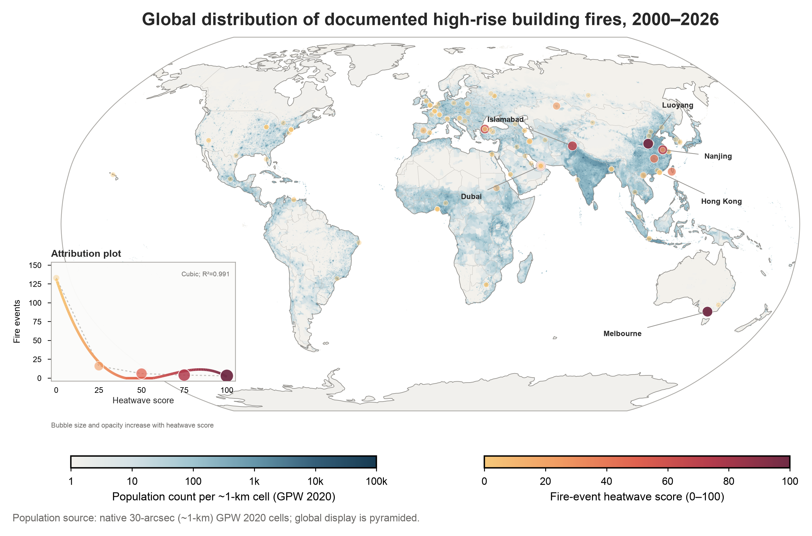

# Global High-Rise Building Fire Map

This project provides a reproducible global map of documented high-rise building fires from 2000 to 2026. The map combines fire-event points with GPW 2020 population counts at native 30-arcsec (approximately 1-km) cells and an ERA5-Land-derived fire-event heatwave score.



## Main files

- `全球城市高层建筑火灾事件数据库_2000-2026.xlsx`: source event workbook.
- `outputs/global_fire_map/global_fire_events_2000_2026.csv`: standardized fire-event dataset.
- `outputs/global_fire_map/global_fire_events_2000_2026_gee_enriched.csv`: GEE-enriched event dataset.
- `outputs/global_fire_map/global_fire_map_gee.ipynb`: Earth Engine Python API workflow.
- `outputs/global_fire_map/global_fire_occurrence_map.png`: final global map preview.
- `outputs/global_fire_map/global_fire_occurrence_map.svg` and `.pdf`: publication-ready vector outputs.
- `outputs/global_fire_map/requirements.txt`: Python dependencies.
- `outputs/global_fire_map/heatwave_scoring_references.enw`: reference-manager-ready heatwave-method citations.
- `GPW2020_GEE.js`: original GPW 2020 Earth Engine JavaScript reference.

## Reproduce the existing map

1. Install Python 3.11 and JupyterLab.
2. Run `pip install -r outputs/global_fire_map/requirements.txt`.
3. Open `outputs/global_fire_map/global_fire_map_gee.ipynb` in Jupyter.
4. Set `RUN_GEE=0` and `USE_EXISTING_ENRICHED=1` to redraw the map from the included enriched CSV.

## Run Google Earth Engine again

Enable the Earth Engine API for your Google Cloud project, grant the service account the required Earth Engine permissions, and set these environment variables before running the Notebook:

```powershell
$env:GEE_PROJECT_ID='your-google-cloud-project-id'
$env:GEE_SERVICE_ACCOUNT='your-service-account@your-project.iam.gserviceaccount.com'
$env:GOOGLE_APPLICATION_CREDENTIALS='D:\secure\service-account-key.json'
$env:RUN_GEE='1'
```

The service-account JSON key is intentionally excluded from this repository. Keep it outside the project directory and never commit or share it.

## Interpretation

The heatwave score uses the fire date and preceding six days of ERA5-Land daily maximum temperature. The threshold is the higher of 30 °C and the local 1991–2020 monthly 90th percentile; cumulative exceedance degree-days are multiplied by 10 and clipped to 0–100. This score describes the thermal conditions surrounding a recorded event and should not be interpreted as proof of causation.

Some coordinates are city representative points rather than exact fire locations. The map reflects documented public-source events and uneven source coverage, not a complete global fire incidence rate.
